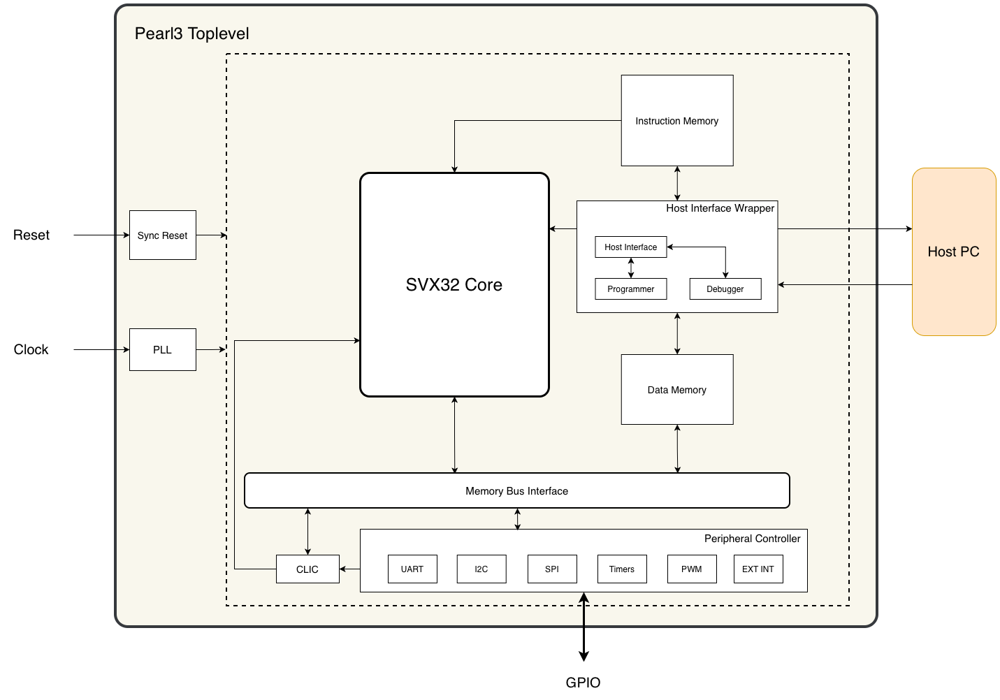

# Pearl3

This repository contains Pearl3, a reference microcontroller implementation based on the [SparrowX32](https://github.com/Rudran97/SparrowX32_pub.git) RISC-V CPU core.
The complete software development kit can be found in [pearl3_firmware](https://github.com/Rudran97/pearl3_firmware_pub.git) repository.

Pearl3 is designed as a lightweight and modular microcontroller system targeting FPGA platforms. The current implementation is optimized for the cyc1000 development board (running on Cyclone 10 LP FPGA - 10CL025YU256C8G). Some parameters such as clock frequency and memory sizes are tailored for this target. However, the design is portable and can be adapted to other FPGA platforms with different performance and resource constraints.

Pearl3 integrates the SparrowX32 CPU core with commonly used microcontroller peripherals such as GPIO, timers, and communication interfaces. It is intended to serve as:

* A reference design for SparrowX32-based systems.
* A development platform for embedded software and hardware experimentation.
* A baseline microcontroller architecture that can be extended or customized.

## Block Diagram

## Key Features

* RISC-V Microcontroller based on SparrowX32 (RV32).

* Clocking -
    * 64 MHz system clock (generated using FPGA PLL on cyc1000).
    * Target-dependent (requires adaptation for other FPGA vendors and tools).

* Memory -
    * 48 kB Program Memory.
    * 16 kB Data RAM.

* GPIO -
    * 32 GPIO pins (PORTA: 16, PORTB: 16) - 29 pins mapped on cyc1000 board.
    * 16 Dedicated output pins - 8 connected to on-board LED.

* Timers -
    * 6 General Purpose Timers:
        * 4 × Dual Compare Timers (DCT).
        * 2 × Input Capture Timers (ICT).

* Communication Interfaces -
    * 2 × UART.
    * 1 × I2C.
    * 1 × SPI.

* Interrupts -
    * 8 mappable interrupt sources.

* PWM -
    * 6 PWM channels (3 per port).

* GPIO Remapping -
    * Pins can be dynamically assigned to peripheral functions:
        * UART, I2C, SPI.
        * PWM outputs.
        * External interrupt inputs.
    * Default GPIO configuration: digital input/output.

* Debugging & Programming -
    * Native UART-based debugger (dedicated UART channel).
    * Used for both debugging and program loading.

## Repository Structure

$REPO_TOP refers to the project root directory. All paths below are relative to this location.

* $REPO_TOP/rtl - Contains all RTL files for the microcontroller, including the peripheral implementations.

* $REPO_TOP/rtl/core - Submodule containing the SparrowX32 core.

* $REPO_TOP/docs - Contains further documentation.

* $REPO_TOP/test/sw - Contains example software programs for testing and validation.

* $REPO_TOP/test/tb - Contains testbenches for simulation of the pearl3_top top-level module.

* $REPO_TOP/test/makehex.py - Python script to convert .hex files generated by the RISC-V toolchain into ROM initialization files.

* $REPO_TOP/Makefile - Builds RTL (for simulation) and example software located in ./test/sw.

## Toolchain and Setup

The following tools are recommended for development:

* RISC-V 32-bit toolchain preferably with imc_zicsr extension for compiling software.

* Intel Quartus Prime Used for synthesis, place-and-route, and programming the cyc1000 FPGA board.

    Note: The current clocking configuration uses Intel-specific PLL IP and must be adapted for other vendors.

* GHDL Used for VHDL syntax checking and static analysis.

* Simulation tools such as QuestaSim or ModelSim.

* Python 3 Required for utility scripts such as makehex.py.

## Notes

This implementation is targeted for the cyc1000 FPGA board. Porting to other platforms may require clocking (PLL) modifications, pin remapping and memory configuration updates. All Peripherals and debug subsystems are designed to be modular, allowing easy customization.